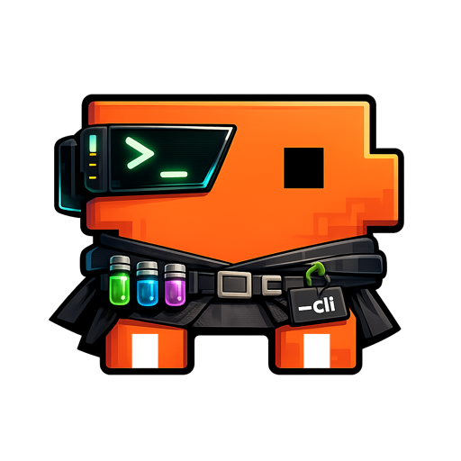

<div align="center">
  
  <h1>Clother</h1>
  <p><strong>One CLI to switch between Claude Code providers instantly.</strong></p>
  <p>
    <a href="LICENSE"></a>
    <a href="https://go.dev/"></a>
    <a href="#platform-support"></a>
  </p>
</div>

<br/>

<div align="center">
  
</div>

## Table of Contents

- [Installation](#installation)
- [Core Usage](#core-usage)
- [Provider Reference](#provider-reference)
- [Troubleshooting](#troubleshooting)
- [VS Code Integration](#vs-code-integration)
- [Platform Support](#platform-support)
- [Under the Hood](#under-the-hood)
- [Contributors](#contributors)
- [Star History](#star-history)
- [License](#license)

## Installation

```bash
# 1. Install Claude Code CLI
curl -fsSL https://claude.ai/install.sh | bash

# 2. Install Clother
curl -fsSL https://raw.githubusercontent.com/jolehuit/clother/main/scripts/install.sh | bash

# 3. Start using it
clother-native                          # Use your Claude Pro/Max/Team subscription
clother-zai                             # Z.AI (GLM-5)
clother-zai --yolo                      # Skip permission prompts
clother-kimi                            # Kimi (kimi-k2.5)
clother-ollama --model qwen3-coder      # Local with Ollama
clother config                          # Configure providers
```

This installs:
- `clother`
- `clother-*` provider launchers
- resume compatibility for `claude --resume ...`

### Install Options

By default, Clother installs launchers to:
- **macOS**: `~/bin`
- **Linux**: `~/.local/bin` (XDG standard)

You can override this with `--bin-dir` or the `CLOTHER_BIN` environment variable:

```bash
# Using --bin-dir flag
curl -fsSL https://raw.githubusercontent.com/jolehuit/clother/main/scripts/install.sh | bash -s -- --bin-dir ~/.local/bin

# Using environment variable
export CLOTHER_BIN="$HOME/.local/bin"
curl -fsSL https://raw.githubusercontent.com/jolehuit/clother/main/scripts/install.sh | bash
```

Clother keeps `claude --resume ...` working with Clother features after install.

## Core Usage

### Commands

| Command | Description |
|---------|-------------|
| `clother config [provider]` | Configure provider |
| `clother list` | List profiles |
| `clother info <provider>` | Show provider details |
| `clother test` | Test connectivity |
| `clother status` | Installation status |
| `clother install` | Install/update Clother |
| `clother uninstall` | Remove everything |

### Changing the Default Model

Each provider launcher comes with a default model (for example `glm-5` for Z.AI). You can override it in two ways:

```bash
# One-time: pass --model through to Claude CLI
clother-zai --model glm-4.7

# Permanent: configure the provider and pick a different default
clother config zai
```

Use `clother info <provider>` to inspect the resolved model.

### Resume

Clother keeps the resume command printed by Claude Code working across providers.

After a provider-launched session, Clother also prints a provider-aware reopen
command such as:

```bash
clother-kimi --resume <session-id>
```

When resuming a non-Claude session into native Claude, Clother temporarily
sanitizes incompatible non-Claude thinking blocks for the duration of that
single launch, then restores the original session file afterwards.

## Provider Reference

### Cloud

| Command | Provider | Model | API Key |
|---------|----------|-------|---------|
| `clother-native` | Anthropic | Claude | Your subscription |
| `clother-zai` | Z.AI | GLM-5 | [z.ai](https://z.ai) |
| `clother-minimax` | MiniMax | MiniMax-M2.5 | [minimax.io](https://minimax.io) |
| `clother-kimi` | Kimi | kimi-k2.5 | [kimi.com](https://kimi.com) |
| `clother-moonshot` | Moonshot AI | kimi-k2.5 | [moonshot.ai](https://moonshot.ai) |
| `clother-deepseek` | DeepSeek | deepseek-chat | [deepseek.com](https://platform.deepseek.com) |
| `clother-mimo` | Xiaomi MiMo | mimo-v2-flash | [xiaomimimo.com](https://platform.xiaomimimo.com) |
| `clother-alibaba` | Alibaba Coding Plan | qwen3.5-plus | [modelstudio](https://modelstudio.console.alibabacloud.com) |
| `clother-alibaba-us` | Alibaba Coding Plan (US) | qwen3.5-plus | [modelstudio](https://modelstudio.console.alibabacloud.com) |

### OpenRouter (100+ Models)

Access Grok, Gemini, Mistral and more via [openrouter.ai](https://openrouter.ai).

```bash
clother config openrouter               # Set API key + add models
# Example: alias moonshotai/kimi-k2.5 as kimi-k25
clother-or-kimi-k25                     # Use it
```

Popular model IDs:

| Model ID | Description |
|----------|-------------|
| `anthropic/claude-opus-4.6` | Claude Opus 4.6 |
| `z-ai/glm-5` | GLM-5 (Z.AI) |
| `minimax/minimax-m2.5` | MiniMax M2.5 |
| `moonshotai/kimi-k2.5` | Kimi K2.5 |
| `qwen/qwen3-coder-next` | Qwen3 Coder Next |
| `deepseek/deepseek-v3.2-speciale` | DeepSeek V3.2 Speciale |

> **Tip**: Find model IDs on [openrouter.ai/models](https://openrouter.ai/models) — click the copy icon next to any model name.

> If a model doesn't work as expected, try the `:exacto` variant (e.g. `moonshotai/kimi-k2-0905:exacto`) which provides better tool calling support.

### China Endpoints

| Command | Endpoint |
|---------|----------|
| `clother-zai-cn` | open.bigmodel.cn |
| `clother-minimax-cn` | api.minimaxi.com |
| `clother-ve` | ark.cn-beijing.volces.com |
| `clother-alibaba-cn` | coding.dashscope.aliyuncs.com |

### Local (No API Key)

| Command | Provider | Port | Setup |
|---------|----------|------|-------|
| `clother-ollama` | Ollama | 11434 | [ollama.com](https://ollama.com) |
| `clother-lmstudio` | LM Studio | 1234 | [lmstudio.ai](https://lmstudio.ai) |
| `clother-llamacpp` | llama.cpp | 8000 | [github.com/ggml-org/llama.cpp](https://github.com/ggml-org/llama.cpp) |

```bash
# Ollama
ollama pull qwen3-coder && ollama serve
clother-ollama --model qwen3-coder

# LM Studio
clother-lmstudio --model <model>

# llama.cpp
./llama-server --model model.gguf --port 8000 --jinja
clother-llamacpp --model <model>
```

### Custom

```bash
clother config custom
clother-myprovider                      # Ready
```

### Alibaba Coding Plan Models

All Alibaba variants (`alibaba`, `alibaba-us`, `alibaba-cn`) share the same API key and support these models:

| Model | Type |
|-------|------|
| `qwen3.5-plus` | Text + Vision (default) |
| `kimi-k2.5` | Text + Vision |
| `glm-5` | Text |
| `MiniMax-M2.5` | Text |
| `qwen3-coder-next` | Code |
| `qwen3-coder-plus` | Code |
| `qwen3-max-2026-01-23` | Text |
| `glm-4.7` | Text |

Switch models with `--model`:

```bash
clother-alibaba --model kimi-k2.5
clother-alibaba --model glm-5
clother-alibaba-cn --model qwen3-coder-next
```

## Troubleshooting

| Problem | Solution |
|---------|----------|
| `claude: command not found` | Install Claude CLI first |
| `clother: command not found` | Add your bin directory to PATH (see [Installation](#installation)) |
| `claude --resume ...` does not behave like Clother | Restart your shell, then run `clother install` again |
| `--yolo` is not recognized | Restart your shell, then run `clother install` again |
| `API key not set` | Run `clother config` |

## VS Code Integration

To use Clother with the official **Claude Code** extension:

1. Open VS Code Settings (`Cmd+,` or `Ctrl+,`).
2. Search for **"Claude Process Wrapper"** (`claudeProcessWrapper`).
3. Set it to the **full path** of your chosen launcher:
   - macOS: `/Users/yourname/bin/clother-zai`
   - Linux: `/home/yourname/.local/bin/clother-zai`
4. Reload VS Code.

> **Note**: Requires Clother v2.6+ (which handles non-interactive shell output correctly).

## Platform Support

macOS (zsh/bash) • Linux (zsh/bash) • Windows (WSL)

## Under the Hood

### How It Works

Clother is a single Go binary. The installer downloads the release artifact,
installs `clother` into your bin directory, then creates:
- `clother-*` symlinks for providers
- a `claude` shim symlink for resume compatibility

At runtime, the binary resolves the selected profile from its own invocation
name, loads config and secrets, sets the required Anthropic-compatible
environment variables, then launches the real Claude binary outside the Clother
bin directory.

Example for `clother-zai`:

```bash
export ANTHROPIC_BASE_URL="https://api.z.ai/api/anthropic"
export ANTHROPIC_AUTH_TOKEN="$ZAI_API_KEY"
exec /path/to/the/real/claude "$@"
```

API keys stored in `~/.local/share/clother/secrets.env` (chmod 600).

`--yolo` is accepted by Clother launchers and by the Clother `claude` shim as
shorthand for `--dangerously-skip-permissions`.

### Local Release Testing

Test the binary installer locally against a local directory or server:

```bash
CLOTHER_RELEASE_BASE_URL=http://127.0.0.1:8000 \
  ./scripts/install.sh install
```

## Contributors

- [@darkokoa](https://github.com/darkokoa) — China endpoints
- [@RawToast](https://github.com/RawToast) — Kimi endpoint fix
- [@sammcj](https://github.com/sammcj) — Security hardening
- [@aprakasa](https://github.com/aprakasa) — Linux compatibility fixes in `load_secrets()`
- [@luciano-fiandesio](https://github.com/luciano-fiandesio) — Install directory improvement (issue)

## Star History

[](https://www.star-history.com/#jolehuit/clother&Date)

## License

MIT © [jolehuit](https://github.com/jolehuit)
