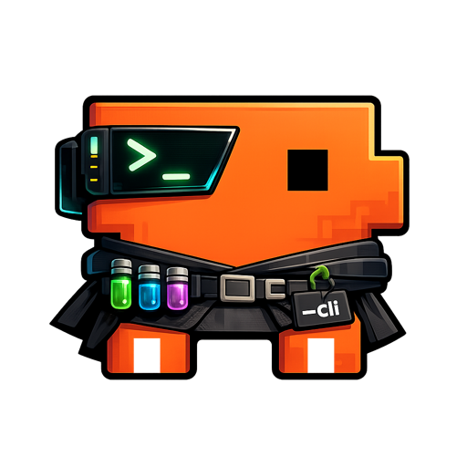

<div align="center">
  
  <h1>Clother</h1>
  <p><strong>One CLI to switch between Claude Code providers instantly.</strong></p>
  <p>
    <a href="LICENSE"></a>
    <a href="https://go.dev/"></a>
    <a href="#platform-support"></a>
    <a href="https://github.com/jolehuit/clother/stargazers"></a>
  </p>
</div>

<br/>

<div align="center">
  
</div>

## Why Clother?

Switching Claude Code providers by hand means editing environment variables, base
URLs, model tiers and launcher scripts every time. Clother reduces that to one
binary: `clother config <provider>` once, then `clother-<provider>` forever.

Clother is an independent project. It is not affiliated with, endorsed by or
sponsored by Anthropic PBC. See [Trademarks and affiliation](#trademarks-and-affiliation).

Read [What will not work](#what-will-not-work) before you install. Pointing
Claude Code at a third-party endpoint costs you features, and some of the
breakage comes from upstream, where Clother cannot fix it.

## Table of Contents

- [What will not work](#what-will-not-work)
- [Where your prompts go, and what you agree to](#where-your-prompts-go-and-what-you-agree-to)
- [Installation](#installation)
  - [Verifying what you install](#verifying-what-you-install)
- [Core Usage](#core-usage)
- [Provider Reference](#provider-reference)
- [Troubleshooting](#troubleshooting)
- [VS Code Integration](#vs-code-integration)
- [Platform Support](#platform-support)
- [Under the Hood](#under-the-hood)
- [Trademarks and affiliation](#trademarks-and-affiliation)
- [Contributors](#contributors)
- [Star History](#star-history)
- [License](#license)

## What will not work

Claude Code changes what it allows on a non-Anthropic endpoint from release to
release. It published 20 to 30 versions per month over the last year, 2.1.233 on
2026-08-14 being the latest tag and 2.1.224 the `stable` one. Treat this list as
a snapshot verified on 2026-08-15, not as a contract.

### Every provider except `clother-native`

As soon as `ANTHROPIC_AUTH_TOKEN`, `ANTHROPIC_API_KEY` or `apiKeyHelper` is set,
or `ANTHROPIC_BASE_URL` points anywhere but Anthropic, Claude Code turns off:

- **Remote Control** and the `/remote-control` command (2.1.139 for the
  credential, 2.1.196 for the base URL).
- **`/schedule`**.
- **claude.ai MCP connectors**.
- **Notification preferences** and push notifications.
- **Voice dictation**.

This is upstream behaviour, not a Clother setting, and there is no flag. Even a
loopback proxy that forwards to `api.anthropic.com` triggers it. Two open issues
ask for a loopback exception:
[#72749](https://github.com/anthropics/claude-code/issues/72749) and
[#76653](https://github.com/anthropics/claude-code/issues/76653).

Cloud, Slack and web sessions are hosted by Anthropic and never read these
variables at all, so they always run on your Anthropic account. What stays local
and keeps working: plugins, skills, subagents, hooks, sandbox, checkpoints,
statusline, keybindings, workflows and agent teams.

**Claude Code sends the same request body to every endpoint**, betas included:
adaptive thinking, `output_config`, `context_management`, the `strict` and
`defer_loading` tool schema fields. A backend that does not tolerate one of them
answers 400. WebSearch currently fails that way on `output_config.effort`, issue
[#82693](https://github.com/anthropics/claude-code/issues/82693). Clother sets
`CLAUDE_CODE_DISABLE_EXPERIMENTAL_BETAS=1` and `DISABLE_INTERLEAVED_THINKING=1`
on every profile that serves its own models, which covers part of it, not all.
The two gateways that front Claude models, `openrouter` and
`vercel-ai-gateway`, keep the betas on: there they are legitimate.

**MCP tool search** is off by default on a non-first-party host, so every MCP
tool is loaded into context up front. Clother sets `ENABLE_TOOL_SEARCH=true` for
the OpenRouter profile only; strict backends answer 400 when it is on.

**Auto-compaction is broken for third-party providers** since Claude Code
2.1.161. Symptom: the session hits a context-limit error instead of compacting.
Issue [#65585](https://github.com/anthropics/claude-code/issues/65585) is still
open. Manual `/compact` still works, so use it. Clother declares the window each
vendor documents, through the catalog: `CLAUDE_CODE_AUTO_COMPACT_WINDOW` on
`zai`, `zai-cn`, `minimax`, `minimax-cn`, `kimi`, `moonshot` and `deepseek`, and
`CLAUDE_CODE_MAX_CONTEXT_TOKENS` on `kimi` and `alibaba-token-plan`. That
mitigates the symptom, it does not fix the upstream bug.

**WebFetch and fast mode call `api.anthropic.com` directly**, without following
`ANTHROPIC_BASE_URL`. On a network that can only reach the provider endpoint
(this is the normal case for the China entries), the WebFetch domain safety
check fails and the tool goes quiet. Clother does not work around this today.

**Auto mode routes its safety classifier through `ANTHROPIC_BASE_URL`**, so the
classification requests are billed by your provider, not by Anthropic. Issue
[#78372](https://github.com/anthropics/claude-code/issues/78372) is open.

### Local backends: `ollama`, `lmstudio`, `llamacpp`, `vllm`

- Claude Code sends a **system message in the middle of the conversation**, which
  breaks any chat template that only accepts `system` in first position.
  `CLAUDE_CODE_DISABLE_EXPERIMENTAL_BETAS=1`, which Clother sets for these
  profiles, does not stop it. Issue
  [#74226](https://github.com/anthropics/claude-code/issues/74226) is open,
  reproduced against Ollama.
- A **byte watchdog** aborts a stream that goes silent for 300 seconds on an
  `ANTHROPIC_BASE_URL` connection. Local backends with no SSE keep-alive and
  long-reasoning models fall into it, so Clother sets
  `CLAUDE_ENABLE_BYTE_WATCHDOG=0` and a long `API_TIMEOUT_MS` for the four local
  profiles.
- Ollama needs at least 32K of context, otherwise Claude Code truncates on the
  first tool result.
- vLLM needs `--enable-auto-tool-choice` plus the tool-call parser for your
  model, and `--served-model-name` when the model name contains a slash.
- llama.cpp needs `--jinja` for tool calls to render.

Run `clother info <provider>` for the per-provider setup notes; they are stored
in the catalog, not in this file.

### Gateways serving Claude model ids

For a model id that starts with `claude-` or resolves to a Claude model, such as
the OpenRouter alias `~anthropic/claude-opus-latest`,
`CLAUDE_CODE_MAX_CONTEXT_TOKENS` is ignored unless `DISABLE_COMPACT` is also
set, which turns compaction off entirely. Declaring the real window on those
profiles has no effect.

`/fast` on OpenRouter needs a pinned Opus id. The catalog's opus tier is
`~anthropic/claude-opus-latest`, a floating alias, so fast mode fails silently
until you pin a dated id with `clother config openrouter` or `--model`.

### Managed machines

Managed settings (`managed-settings.json`, `managed-settings.d/`, the macOS
plist, the Windows registry, server-managed settings) win against the Clother
config overlay. If your organisation pins `forceLoginOrgUUID`, Claude Code
refuses to start for any session carrying `ANTHROPIC_AUTH_TOKEN`, so no Clother
provider will work on that machine, whatever you configure.

### Not supported on purpose

Copilot, Cursor, Windsurf, Codex and Gemini subscriptions cannot be used from
Claude Code. None of them publishes an Anthropic-compatible endpoint; the only
bridges are community proxies that sit outside their terms of service and can
get the account banned. Clother does not ship them.

## Where your prompts go, and what you agree to

Clother processes nothing. It points the Claude Code CLI at the endpoint you
chose, and your prompts, file contents and tool output are sent to that
provider.

**Data location.** Several catalog entries terminate outside the EU and the US.
`open.bigmodel.cn`, `api.minimaxi.com`, `ark.cn-beijing.volces.com`,
`coding.dashscope.aliyuncs.com` and `token-plan.cn-beijing.maas.aliyuncs.com`
are mainland China endpoints. The international fronts of the same vendors
(`api.z.ai`, `api.minimax.io`, `api.kimi.com`, `api.moonshot.ai`,
`api.deepseek.com`, `api.xiaomimimo.com`) are separate endpoints with their own
terms; where inference runs is documented by each vendor, not by Clother.
Alibaba also documents a pay-as-you-go endpoint in `ap-southeast-1` (Singapore).
Its host carries your workspace id, so it cannot live in a shared catalog;
register it yourself with `clother config custom` if you need to stay out of
mainland China. If you send client code through any of these, check it with
whoever owns that decision at your company.

**Terms worth reading before you subscribe** (read 2026-08-15, they change):

- **Alibaba Model Studio Coding Plan** prohibits non-interactive use. The plan
  covers interactive use inside a coding agent; automated scripts, CI jobs and
  application backends are a violation that can suspend or revoke the key.
  Clother makes `claude -p` and headless runs easy, so this one is on you.
  Subscribing also authorises Alibaba to use your inputs and outputs to improve
  the service and optimise the models, and revoking that consent only applies
  going forward. Account sharing is prohibited and the plan is non-refundable.
  Source: <https://help.aliyun.com/en/model-studio/coding-plan>.
- **Z.AI GLM Coding Plan** prohibits account sharing, restricts use to the tools
  it officially supports, and states that more than three violations can lead to
  a ban. It renews automatically, cancellation is due at least three days before
  the billing date, and there are no refunds, unused quota included. Source:
  <https://docs.z.ai/devpack/usage-policy>.
- **Alibaba key format.** The Coding Plan takes a dedicated `sk-sp-` key. Using a
  general Model Studio `sk-` key on that endpoint silently switches you to
  pay-as-you-go billing. Run `clother info alibaba` before the first call.

## Installation

You need the Claude Code CLI installed first. Clother launches it, it does not
replace it.

### Homebrew (macOS, recommended)

```bash
# 1. Install the Claude Code CLI
curl -fsSL https://claude.ai/install.sh | bash

# 2. Install Clother
brew tap jolehuit/tap
brew install clother

# 3. Configure one provider (this is the step that stores the API key)
clother config zai

# 4. Run it
clother-zai
clother-zai --yolo        # skip permission prompts
```

The formula installs every `clother-*` provider launcher into
`$(brew --prefix)/bin`. `brew upgrade clother` keeps them current, and
`clother update` routes there by itself when the running binary sits in a
Homebrew Cellar and `brew` knows a `clother` formula. If either is false it
downloads the release instead, so a binary merely copied next to a Homebrew tree
is still updatable.

### curl (macOS / Linux)

```bash
# 1. Install the Claude Code CLI
curl -fsSL https://claude.ai/install.sh | bash

# 2. Install Clother, pinned to a tag. Read the script before running it
curl -fsSLO https://raw.githubusercontent.com/jolehuit/clother/v3.0.10/scripts/install.sh
CLOTHER_VERSION=v3.0.10 bash install.sh

# 3. Configure one provider
clother config zai

# 4. Run it
clother-zai
clother-ollama --model qwen3-coder     # local, no API key
```

Step 3 is not optional. `clother-zai` on a fresh machine exits non-zero and
tells you to run `clother config zai`; the launcher has no key to use before
that. Local providers (`ollama`, `lmstudio`, `llamacpp`, `vllm`) and
`clother-native` are the only profiles that work with no configuration.

This installs `clother`, the `clother-*` provider launchers, and a `claude` shim
that keeps `claude --resume ...` behaving like Clother.

### Verifying what you install

**The install script.** Pin a tag. A `.../clother/main/scripts/install.sh` URL
follows the default branch, so what you run today is not what you read
yesterday, and a compromised branch reaches every new install at once. Download
the script first, read it, then run it. The repository at that tag is the
reference: `git show v3.0.10:scripts/install.sh` gives you the same bytes.

Pinning the script does not pin the binary. Without `CLOTHER_VERSION`, any copy
of `install.sh` downloads `releases/latest`. Set `CLOTHER_VERSION=v3.0.10` to
get that exact release.

One more trap: run `install.sh` from inside a clone of this repository and it
builds from source with `go run` instead of downloading anything. That is
deliberate, it is how contributors test their own tree. Run it from an empty
directory, or set `CLOTHER_INSTALL_MODE=release`, when you want the released
binary.

**The release archive.** `scripts/install.sh` downloads `checksums.txt` from the
release and verifies the SHA-256 of the archive against the entry for the exact
asset name. There is no "continue anyway" branch: a mismatch, a missing entry,
or a machine with none of `shasum`, `sha256sum` or `openssl` aborts the install.
You can do the same check by hand:

```bash
curl -fsSLO https://github.com/jolehuit/clother/releases/download/v3.0.10/checksums.txt
curl -fsSLO https://github.com/jolehuit/clother/releases/download/v3.0.10/clother_darwin_arm64.tar.gz
grep clother_darwin_arm64.tar.gz checksums.txt | shasum -a 256 -c -
```

**The signature.** A checksum served by the same origin as the archive proves
nothing about authenticity, so `clother install` and `clother update` also fetch
`checksums.txt.minisig` and verify an ed25519 [minisign](https://jedisct1.github.io/minisign/)
signature of `checksums.txt` against a public key compiled into the binary.
Verification is stdlib-only, in `internal/update/signature.go`.

Current state, and it is deliberate: **no signing key exists yet**. Both
`internal/update/keys/current.pub` and `next.pub` are placeholders, and the
release workflow publishes unsigned with `CLOTHER_ALLOW_UNSIGNED_RELEASE=1`. So
today a missing signature prints a loud warning and falls back to checksum only,
while a signature that is present and does not verify is always a hard refusal.
Dropping a real key into `current.pub` flips missing signatures to a hard
refusal too, with no opt-out. Until then, build with
`go build -tags clother_strict_signatures ./cmd/clother` if you need an install
path that refuses unsigned artifacts now.

`scripts/install.sh` verifies the checksum but not the signature: it cannot
check ed25519 in portable shell. It still downloads `checksums.txt.minisig` to
tell you where you stand. When the release publishes a signature, it prints a
note asking you to run `clother update` afterwards, which does verify it. When
the release publishes none, it prints the same warning the binary prints. That
gap is why the tag pin and reading the script matter on this first step.

The rule is stricter on a release origin you named yourself. With
`CLOTHER_RELEASE_BASE_URL` or `CLOTHER_UPDATE_URL` set, `clother install` and
`clother update` refuse a release with no signature outright, because a checksum
served by an origin someone pointed you at proves nothing at all.
`CLOTHER_ALLOW_UNSIGNED_ORIGIN=1` is the explicit way out, for the local mirror
workflow described in [Under the Hood](#under-the-hood).

Homebrew installs are covered by the formula's own checksum, not by this path.

### Install options

By default, launchers go to:

- the directory holding your existing `claude` binary, when `claude` is on `PATH`
- otherwise `~/bin` on macOS
- otherwise `~/.local/bin` on Linux

If that directory is not on `PATH`, `clother install` prints a warning naming
it. Override with `CLOTHER_BIN` or with `--bin-dir` after the subcommand:

```bash
CLOTHER_BIN="$HOME/.local/bin" bash install.sh
# or, explicitly
bash install.sh install --bin-dir ~/.local/bin
```

`install.sh` forwards its arguments to the `clother` binary it just verified and
defaults to `install` when given none. `--bin-dir` alone is therefore not enough:
without the `install` subcommand in front of it, the binary prints its help and
installs nothing.

### Update

```bash
clother update          # brew upgrade clother when installed by Homebrew, download otherwise
```

It also refreshes the launcher symlinks. A failed download exits non-zero and
says so instead of reporting an install that never happened.

## Core Usage

### Commands

| Command | Description |
|---------|-------------|
| `clother config [provider]` | Configure a provider: API key, model, base URL |
| `clother remove <provider>` | Forget one provider: its stored key and its settings |
| `clother list` | List profiles and whether they are configured |
| `clother info <provider>` | Show the resolved settings, setup notes and doc URL |
| `clother test [provider]` | Check that provider endpoints are reachable |
| `clother bench [provider...] [--prompt "..."]` | Benchmark provider latency |
| `clother status` | Version, directories, profile count |
| `clother install` | Install or refresh the launcher symlinks |
| `clother update` | Update to the latest release |
| `clother uninstall` | Remove the launchers, the shim, and the Clother config, data and cache directories |
| `clother help [command]` | Help, globally or for one command |

`clother help <command>` and `clother <command> --help` print the same page.
Commands that take no argument now reject extra ones instead of ignoring them.

`uninstall` deletes your stored keys along with the rest: `secrets.env` lives in
the data directory it removes. It lists every path first and asks before
touching anything, `-y` included, and it only deletes what Clother itself wrote,
so a directory holding files of yours is kept with a warning. To drop a single
provider, use `clother remove <provider>`.

`test` and `bench` do not fail the same way. `test` exits non-zero as soon as
one endpoint is unreachable, `bench` only when every provider failed. Watch
health with `test`.

### Global options

| Option | Effect |
|--------|--------|
| `-h, --help` | Help. After a command, that command's help. |
| `-V, --version` | Print the Clother version. |
| `-v, --verbose` | Diagnostic details on stderr. |
| `-d, --debug` | Parsed command and resolved directories on stderr. Implies `--verbose`. Launchers take their tracing from `CLOTHER_DEBUG=1` instead. |
| `-q, --quiet` | Suppress non-essential output. |
| `-y, --yes` | Answer yes to confirmations. |
| `--no-input` | Never prompt, fail instead. For CI. |
| `--no-banner` | Do not print the launcher banner. |
| `--bin-dir <path>` | Where launchers are installed or removed. |
| `--json` / `--plain` | Machine-readable and bare output. |

### Configuring a provider

```bash
clother config zai        # direct form, no menu
clother config            # numbered menu; it accepts a number or a provider name
```

The API key is read from `/dev/tty` with echo disabled and is never printed back
in full. There is no visible fallback: if `/dev/tty` cannot be opened or echo
cannot be turned off, `clother config` refuses to read the key rather than show
it on screen.

### Configuring without a terminal (CI, Docker, scripts)

With no terminal, drive `clother config` with environment variables. It then
runs non-interactively and fails loudly rather than pretending to have saved
something:

```bash
# Key on stdin: it never appears in the process list or the shell history
CLOTHER_API_KEY=- clother config zai < key.txt

# Or inline, plus the optional settings
CLOTHER_API_KEY="$ZAI_KEY" CLOTHER_MODEL=glm-5.3 clother config zai
CLOTHER_API_KEY="$OR_KEY" CLOTHER_ALIAS=kimi-k25 clother config openrouter
CLOTHER_API_KEY="$KEY" CLOTHER_PROVIDER_NAME=myprovider \
  CLOTHER_BASE_URL=https://api.example.com/anthropic clother config custom
```

Setting any of these makes `clother config` non-interactive even on a real
terminal, so do not export them from your shell profile. Read the Alibaba terms
in [Where your prompts go](#where-your-prompts-go-and-what-you-agree-to) before
you wire a subscription plan into CI.

### Environment

| Variable | Effect |
|----------|--------|
| `CLOTHER_CONFIG_DIR` / `CLOTHER_DATA_DIR` / `CLOTHER_CACHE_DIR` | Override the XDG directories |
| `CLOTHER_BIN` | Directory for the launcher symlinks |
| `CLOTHER_NO_UPDATE_CHECK=1` | Disable the once-a-day update check against github.com |
| `CLOTHER_UPDATE_URL` | Override the update metadata URL (https only, loopback excepted) |
| `CLOTHER_API_KEY`, `CLOTHER_MODEL`, `CLOTHER_BASE_URL`, `CLOTHER_ALIAS`, `CLOTHER_PROVIDER_NAME` | Non-interactive `clother config` |
| `CLOTHER_DEBUG=1` | Trace launcher invocations on stderr, secrets masked |
| `NO_COLOR` | Disable colored output |

Three more are read by the install and update path only:

| Variable | Effect |
|----------|--------|
| `CLOTHER_VERSION` | Tag `install.sh` downloads, for example `v3.0.10`. Default `latest` |
| `CLOTHER_RELEASE_BASE_URL` | Where release assets are fetched from (https only, loopback excepted) |
| `CLOTHER_ALLOW_UNSIGNED_ORIGIN=1` | Accept an unsigned release from such a hand-picked origin |

### Changing the model

Each launcher carries a default model from the catalog. Override it two ways:

```bash
clother-zai --model glm-4.7     # one session
clother config zai              # pick a new default
```

`--model` also accepts the Claude tier aliases. `opus`, `opusplan`, `opus[1m]`,
`sonnet`, `sonnet[1m]` and `haiku` resolve through the provider's own tier
mapping, and fall back to the profile's default model when the provider declares
no such tier, instead of sending a Claude model id the provider does not serve.
`default`, `best` and `fable` resolve to the profile's default model. A concrete
id given to `--model` pins every tier for that session.

Choosing a model in `clother config` does the same thing permanently: the stored
model replaces the whole tier map, so a provider whose `haiku` tier pointed at a
cheap model now answers every tier with the model you picked. Clear the override
by picking the provider's default again.

### Benchmarking

```bash
clother bench                              # every configured provider
clother bench zai kimi                     # selected providers
clother bench --prompt "Write a haiku"     # custom prompt
```

Output shows TTFT (time to first token) and total response time, fastest first:

```
  Provider           Model                      TTFT    Total   Preview
  ──────────────────────────────────────────────────────────────────────────────
  kimi               k3-256k                    180ms    0.9s   "Hello!"
  zai                glm-5.3[1m]                312ms    1.2s   "Hello!"
```

Only providers with a stored key are benchmarked. `native` and the local
profiles are skipped.

### Resume

Clother keeps the resume command printed by Claude Code working across
providers, and prints a provider-aware reopen command of its own:

```bash
clother-kimi --resume <session-id>
```

Resuming a non-Claude session into native Claude sanitizes the incompatible
thinking blocks for the duration of that single launch, then restores the
original session file.

## Provider Reference

`clother list` is the live list. `clother info <provider>` prints the base URL,
the resolved model, the credential variable and its status, the setup notes, and
the documentation page the entry was verified against with the date;
`clother info --json <provider>` adds the full tier map and the list of
credentials scrubbed from the session. The catalog is the source of truth; the
tables below are a snapshot of it taken on **2026-08-15**.

No prices here on purpose. Every vendor in this table changed its pricing at
least once in the last twelve months, and several run different grids on their
domestic and international sites. Follow the doc link.

### Cloud

| Command | Provider | Default model | Key variable | Docs |
|---------|----------|---------------|--------------|------|
| `clother-native` | Anthropic | your subscription's | none | [authentication](https://code.claude.com/docs/en/authentication) |
| `clother-zai` | Z.AI International | `glm-5.3[1m]` | `ZAI_API_KEY` | [docs.z.ai](https://docs.z.ai/devpack/latest-model) |
| `clother-minimax` | MiniMax International | `MiniMax-M3[1m]` | `MINIMAX_API_KEY` | [platform.minimax.io](https://platform.minimax.io/docs/token-plan/claude-code) |
| `clother-kimi` | Kimi Code subscription | `k3-256k` | `KIMI_API_KEY` | [kimi.com](https://www.kimi.com/code/docs/en/third-party-tools/claude-code.html) |
| `clother-moonshot` | Moonshot / Kimi platform, per token | `kimi-k3[1m]` | `MOONSHOT_API_KEY` | [platform.kimi.ai](https://platform.kimi.ai/docs/guide/claude-code-kimi) |
| `clother-deepseek` | DeepSeek | `deepseek-v4-pro[1m]` | `DEEPSEEK_API_KEY` | [api-docs.deepseek.com](https://api-docs.deepseek.com/quick_start/agent_integrations/claude_code) |
| `clother-mimo` | Xiaomi MiMo | `mimo-v2.5-pro` | `MIMO_API_KEY` | [mimo.xiaomi.com](https://mimo.xiaomi.com/mimocode/models-provider) |

A Kimi Code key and a Moonshot platform key are not interchangeable: they are
two products with two endpoints.

`clother-kimi` and `clother-sambanova` carry the credential in
`ANTHROPIC_API_KEY`, because those two endpoints reject a bearer token. Every
other provider uses `ANTHROPIC_AUTH_TOKEN`. The catalog records which one per
provider and Clother blanks the other; you never set either by hand.

### China endpoints

| Command | Provider | Default model | Key variable | Docs |
|---------|----------|---------------|--------------|------|
| `clother-zai-cn` | Zhipu / BigModel | `glm-5.3[1m]` | `ZAI_CN_API_KEY` | [docs.bigmodel.cn](https://docs.bigmodel.cn/cn/coding-plan/overview) |
| `clother-minimax-cn` | MiniMax China | `MiniMax-M3[1m]` | `MINIMAX_CN_API_KEY` | [platform.minimax.io](https://platform.minimax.io/docs/token-plan/claude-code) |
| `clother-alibaba` | Alibaba Model Studio, Coding Plan | `qwen3.7-plus` | `ALIBABA_API_KEY` | [help.aliyun.com](https://help.aliyun.com/en/model-studio/claude-code) |
| `clother-alibaba-token-plan` | Alibaba Model Studio, Token Plan | `qwen3.8-max` | `ALIBABA_TOKEN_PLAN_API_KEY` | [help.aliyun.com](https://help.aliyun.com/en/model-studio/claude-code) |
| `clother-ve` | VolcEngine Ark Coding Plan | `doubao-seed-code` | `ARK_API_KEY` | [volcengine.com](https://www.volcengine.com/article/38136) |

Read [Where your prompts go](#where-your-prompts-go-and-what-you-agree-to)
before using these.

### Gateways

| Command | Endpoint | Default model | Key variable | Docs |
|---------|----------|---------------|--------------|------|
| `clother-openrouter` | `openrouter.ai/api` | `~anthropic/claude-sonnet-latest` | `OPENROUTER_API_KEY` | [openrouter.ai](https://openrouter.ai/docs/cookbook/coding-agents/claude-code-integration) |
| `clother-vercel-ai-gateway` | `ai-gateway.vercel.sh/claude-code` | none, pick from `/model` | `AI_GATEWAY_API_KEY` | [vercel.com](https://vercel.com/docs/ai-gateway/coding-agents/claude-code) |
| `clother-fireworks` | `api.fireworks.ai/inference` | `accounts/fireworks/models/kimi-k2p5` | `FIREWORKS_API_KEY` | [docs.fireworks.ai](https://docs.fireworks.ai/tools-sdks/anthropic-compatibility) |
| `clother-sambanova` | `api.sambanova.ai` | `MiniMax-M2.7` | `SAMBANOVA_API_KEY` | [sambanova.ai](https://sambanova.ai/blog/sambacloud-now-supports-the-anthropic-messages-api) |

None of these base URLs takes a `/v1` suffix: the Anthropic SDK appends
`/v1/messages` itself, and adding it yields a 404. OpenRouter and Vercel also
enable the gateway model picker, so `/model` lists what the gateway serves.
OpenRouter guarantees its Anthropic surface only for Anthropic-provided models.
Fireworks model ids are full account paths, and it serves no web search or code
execution tool.

### OpenRouter aliases

```bash
clother config openrouter               # store the key, then add model aliases
clother-or kimi-k25                     # works on every install
clother-or-kimi-k25                     # per-alias shortcut, curl installs only
```

`clother-or <alias>` works everywhere. curl installs also get a
`clother-or-<alias>` symlink per alias; Homebrew installs skip per-alias
symlinks because the formula owns its bin directory.

Model ids are on [openrouter.ai/models](https://openrouter.ai/models), which is
also where OpenRouter documents the `:exacto` variants it recommends when tool
calling misbehaves.

`clother remove openrouter` drops the key and every alias at once;
`clother remove or-<alias>` drops one alias and keeps the key.

### Local (no API key)

| Command | Backend | Default port | Setup |
|---------|---------|--------------|-------|
| `clother-ollama` | Ollama | 11434 | [ollama.com](https://ollama.com/blog/claude) |
| `clother-lmstudio` | LM Studio | 1234 | [lmstudio.ai](https://lmstudio.ai/blog/claudecode) |
| `clother-llamacpp` | llama.cpp | 8080 | [llama.cpp](https://huggingface.co/blog/ggml-org/anthropic-messages-api-in-llamacpp) |
| `clother-vllm` | vLLM | 8000 | [docs.vllm.ai](https://docs.vllm.ai/en/stable/serving/integrations/claude_code/) |

```bash
# Ollama
ollama pull qwen3-coder && ollama serve
clother-ollama --model qwen3-coder

# LM Studio
clother-lmstudio --model <model>

# llama.cpp, port 8080
./llama-server --model model.gguf --jinja
clother-llamacpp --model <model>
```

See [What will not work](#what-will-not-work) for the upstream issues that hit
local backends.

#### Remote backends

Local launchers default to `localhost`, but the backend can live elsewhere:

```bash
clother config lmstudio
# Base URL [http://localhost:1234]: http://192.168.123.123:1234
clother-lmstudio --model <model>
```

Same for `ollama`, `llamacpp` and `vllm`. Enter the catalog URL again to switch
back. The prompt only appears for these four profiles; a cloud provider's base
URL comes from the catalog, and `clother config custom` is the way to point at
anything else.

### Custom

Any Anthropic-compatible endpoint:

```bash
clother config custom                   # for example, name it "myprovider"
clother-custom myprovider               # works on every install
clother-myprovider                      # per-provider shortcut, curl installs only
```

### Alibaba plans

Alibaba ships two plans, two endpoints, two keys: `clother-alibaba` (Coding
Plan, `ALIBABA_API_KEY`) and `clother-alibaba-token-plan` (Token Plan,
`ALIBABA_TOKEN_PLAN_API_KEY`). Configuring one does not touch the other.

The Coding Plan matches model ids character by character. A version that is not
on its list is rejected, never downgraded, and the endpoint serves
`/v1/messages` only, so model discovery answers 404. The ids the catalog carries:

`qwen3.7-plus` (default), `qwen3.7-plus[1m]`, `qwen3.6-plus`, `qwen3.5-plus`,
`kimi-k2.5`, `glm-5`, `MiniMax-M2.5`, `qwen3-max-2026-01-23`,
`qwen3-coder-next`, `qwen3-coder-plus`, `glm-4.7`.

```bash
clother-alibaba --model kimi-k2.5
clother-alibaba-token-plan --model qwen3.7-max
```

## Troubleshooting

| Problem | Solution |
|---------|----------|
| `claude: command not found` | Install the Claude Code CLI first |
| `clother: command not found` | `clother status` prints the bin directory; add it to `PATH` and restart your shell |
| `<PROVIDER>_API_KEY not configured` | Run `clother config <provider>`. Without a terminal, `CLOTHER_API_KEY=- clother config <provider> < key.txt` |
| `claude --resume ...` does not behave like Clother | Restart your shell, then run `clother install` again |
| `--yolo` is not recognized | Restart your shell, then run `clother install` again |
| Session dies on a context limit instead of compacting | Upstream issue [#65585](https://github.com/anthropics/claude-code/issues/65585); use `/compact` by hand |
| WebFetch returns nothing on a China endpoint | The domain safety check calls `api.anthropic.com` directly; unblock it or avoid WebFetch |
| Claude Code refuses to start with an org error | Your machine has `forceLoginOrgUUID` in managed settings; no third-party credential can work there |
| Every model tier answers with the same model | A model stored by `clother config` replaces the tier map; run `clother config <provider>` and accept the catalog default to restore it |
| Want to drop one provider's key | `clother remove <provider>`, not `uninstall`, which also deletes the config and data directories |
| Config file is unreadable | Clother warns and runs with defaults; `config`, `install` and `remove` refuse to run so they cannot overwrite it |

`CLOTHER_DEBUG=1 clother-<provider> --version` prints the resolved target, the
base URL, a masked token and every variable set or purged. For the `clother`
commands themselves, `-d` prints the parsed command and the directories in use.

## VS Code Integration

Clother works with the official Claude Code extension, version 2.6 or later.

1. Open VS Code settings (`Cmd+,` or `Ctrl+,`).
2. Search for **Claude Process Wrapper** (`claudeProcessWrapper`).
3. Set it to the full path of a launcher, for example
   `/Users/yourname/bin/clother-zai` or `/home/yourname/.local/bin/clother-zai`.
4. Reload VS Code.

## Platform Support

macOS (zsh/bash), Linux (zsh/bash), Windows through WSL.

## Under the Hood

### Startup

Clother is a single Go binary. The installer places `clother` in your bin
directory, then creates one `clother-<profile>` symlink per profile, the
`clother-or` and `clother-custom` gateway launchers, and a `claude` shim for
resume compatibility. Anything already sitting at `claude` is moved aside to
`claude-real` rather than deleted, and `clother uninstall` puts it back.

At runtime the binary reads its own invocation name to pick the profile, loads
the config and the secrets, builds the child environment, prepares a temporary
Claude config directory, then runs the real `claude`: the first one on an
absolute `PATH` entry that is not one of Clother's own symlinks, or
`claude-real` in the bin directory as a fallback.

API keys live in `$XDG_DATA_HOME/clother/secrets.env`, that is
`~/.local/share/clother/secrets.env` by default on both macOS and Linux, mode
600 inside a directory Clother keeps at 700. `clother status` prints the paths
in use.

`--yolo` is accepted by the launchers and by the `claude` shim as shorthand for
`--dangerously-skip-permissions`. It is only rewritten when it appears as a
flag, never when it is the value of another flag or after `--`.

### The environment Clother builds

Not two exports. For a non-native profile, the child environment is built like
this.

**Purged first**, so an inherited shell configuration cannot redirect the
session or leak another provider's key into it:

- every inherited `ANTHROPIC_*` variable
- the routing variables: `CLAUDE_CODE_USE_BEDROCK`, `CLAUDE_CODE_USE_VERTEX`,
  `CLAUDE_CODE_USE_FOUNDRY`, `CLAUDE_CODE_SKIP_BEDROCK_AUTH`,
  `CLAUDE_CODE_SKIP_VERTEX_AUTH`, `AWS_BEARER_TOKEN_BEDROCK`, `CLOUD_ML_REGION`,
  `CLAUDE_CODE_SUBAGENT_MODEL`, `CLAUDE_CODE_MAX_OUTPUT_TOKENS`, `API_TIMEOUT_MS`
- every other provider's key variable from the catalog and from your custom
  providers, keeping only the one this profile needs

**Then set:**

- `ANTHROPIC_BASE_URL`, the provider endpoint
- `ANTHROPIC_MODEL`, the session model
- one variable per tier: `ANTHROPIC_DEFAULT_HAIKU_MODEL`,
  `ANTHROPIC_DEFAULT_SONNET_MODEL`, `ANTHROPIC_DEFAULT_OPUS_MODEL`,
  `ANTHROPIC_DEFAULT_FABLE_MODEL`, plus `ANTHROPIC_SMALL_FAST_MODEL` written
  from the `small` tier. That last one is deprecated upstream in favour of the
  haiku variable and is kept for older Claude Code versions. A tier the provider
  does not declare falls back to the session model rather than being left to
  Claude Code's built-in Claude ids, which the provider would answer with a 404.
- the credential, in `ANTHROPIC_AUTH_TOKEN` or `ANTHROPIC_API_KEY` depending on
  what the provider documents. The other one is set to the empty string, not
  merely absent, because several providers answer 401 or fall back to
  `api.anthropic.com` when both are present.
- `CLAUDE_CODE_SUBPROCESS_ENV_SCRUB=1`, forced, so the credential Clother just
  injected is not readable by every Bash command, hook and MCP server of the
  session. An inherited value that says otherwise is overridden and named on
  stderr; this one is not yours to turn off, because the credential is not one
  you exported
- three session defaults, each posted only when you have not set it yourself:
  `CLAUDE_CODE_DISABLE_NONESSENTIAL_TRAFFIC=1`, `DISABLE_TELEMETRY=1` and
  `DISABLE_ERROR_REPORTING=1`
- whatever `extra_env` the catalog declares for that provider, applied last, so
  a provider entry can override any default above. This is where the beta
  neutralisation (`CLAUDE_CODE_DISABLE_EXPERIMENTAL_BETAS`,
  `DISABLE_INTERLEAVED_THINKING`), the context window and the timeouts live.
  Being data rather than code, a provider fix ships as a catalog patch.

So a real profile sets more than a dozen variables, not two. Measured on
2026-08-16 with Clother 3.0.10: 13 for `clother-ollama`, 17 for `clother-mimo`,
19 for `clother-zai`. Read the exact set for your own configuration rather than
assuming this list:

```bash
CLOTHER_DEBUG=1 clother-zai --version
```

It prints every variable set and every variable purged, with the token masked,
so the output can go into a bug report as is.

`clother-native` is the exception: it clears the inherited `ANTHROPIC_*` and the
foreign keys, then sets nothing and skips the overlay below. Your subscription
login, your model aliases and your own Anthropic routing stay yours.

### The Claude config overlay

Exported environment variables are not enough. Claude Code documents that a
value in a settings file wins against a shell export, and several releases
between 2.1.141 and 2.1.211 dropped an exported `ANTHROPIC_BASE_URL` in
background sessions and in `claude agents` workers, which sends the third-party
key to `api.anthropic.com` and gets a 401. So the settings file is the vehicle,
and for every non-native profile that has a model to pin Clother builds a
throwaway `CLAUDE_CONFIG_DIR` for the launch:

- a temporary directory, with every entry of `~/.claude` symlinked into it, so
  your skills, commands, plugins and projects are all there and writes go
  through to the real directory
- except `.credentials.json`, which is never mirrored: `CLAUDE_CONFIG_DIR`
  relocates the OAuth store, and a token refresh performed during a third-party
  session would overwrite your Anthropic subscription credential
- a rewritten `settings.json`, mode 600, carrying the session model and the
  model variables in its `env` block. `apiKeyHelper`, `awsAuthRefresh` and
  `forceLoginMethod` are stripped, and so is anything in your `env` block that
  looks like a credential. The auth token is deliberately not written to disk:
  the child already has it in its environment.
- a `.claude.json` state file, seeded with `hasCompletedOnboarding` when you
  have none, so Claude Code does not replay its onboarding wizard inside a
  directory that is about to be deleted

When the session ends, files Claude Code created inside the overlay are moved
back into `~/.claude` and the directory is removed. `settings.json` is merged key
by key instead of being copied, under a lock on the real file, so the theme,
permissions and hooks Claude Code wrote during the session survive even when
several sessions end at the same time; the `model` and `env` keys Clother itself
wrote are the ones left behind. An overlay left by a crash or a `SIGKILL` is
purged on the next launch once its owner process is gone and it is more than 24
hours old.

### Process model

Clother does not `exec`-replace itself. It starts `claude` as a child with
`exec.CommandContext`, forwards `SIGTERM` and `SIGHUP` to it, lets `claude`
handle `SIGINT` and `SIGQUIT` itself, and exits with the child's status
(`128 + signal` when the child was signalled). That is what makes the overlay
cleanup and the provider-aware resume hint possible: something has to outlive
the child.

### Local release testing

```bash
CLOTHER_ALLOW_UNSIGNED_ORIGIN=1 CLOTHER_RELEASE_BASE_URL=http://127.0.0.1:8000 \
  ./scripts/install.sh install
```

`CLOTHER_ALLOW_UNSIGNED_ORIGIN=1` is required as long as your mirror serves no
`checksums.txt.minisig`: a hand-picked origin with no signature is a refusal,
not a warning.

`http://` is accepted only for a loopback host (`127.0.0.1`, `localhost`,
`[::1]`). Every other `http://` URL is refused by both `install.sh` and the
binary, including one pointing at a private network address: an unauthenticated
plaintext channel is how a release gets swapped in transit. The same rule
applies to `CLOTHER_UPDATE_URL` and `CLOTHER_BOOTSTRAP_URL`.

## Trademarks and affiliation

Clother is an independent open-source project. It is not affiliated with,
endorsed by, sponsored by, or otherwise associated with Anthropic PBC.

Claude and Claude Code are trademarks of Anthropic PBC. They are used here only
to name the software Clother launches and the API surface it targets, which is
nominative descriptive use. Clother ships no Anthropic code and grants no access
to Anthropic services.

All other product, company and service names in this document are the property
of their respective owners and are used the same way. Provider names in the
catalog identify the endpoints Clother can point at; none of those vendors
sponsors or reviews this project.

## Contributors

- [@darkokoa](https://github.com/darkokoa): China endpoints
- [@RawToast](https://github.com/RawToast): Kimi endpoint fix
- [@sammcj](https://github.com/sammcj): Security hardening
- [@aprakasa](https://github.com/aprakasa): Linux compatibility fixes in `load_secrets()`
- [@luciano-fiandesio](https://github.com/luciano-fiandesio): Install directory improvement (issue)
- [@canberksinangil](https://github.com/canberksinangil): Config overlay fix, GLM default
- [@yasaricli](https://github.com/yasaricli): `clother bench` command, GLM support
- [@jeliseocd](https://github.com/jeliseocd): Config overlay collision report and diagnosis

## Star History

[](https://www.star-history.com/#jolehuit/clother&Date)

## License

MIT © [jolehuit](https://github.com/jolehuit)
